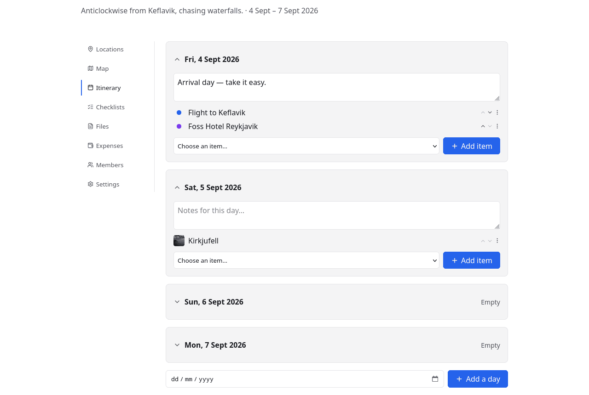
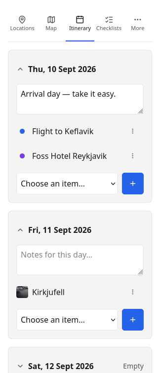
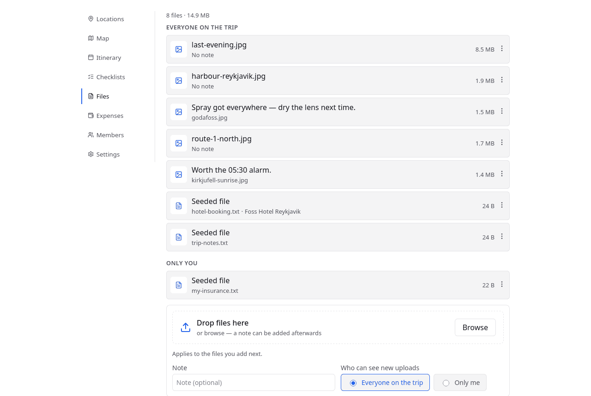
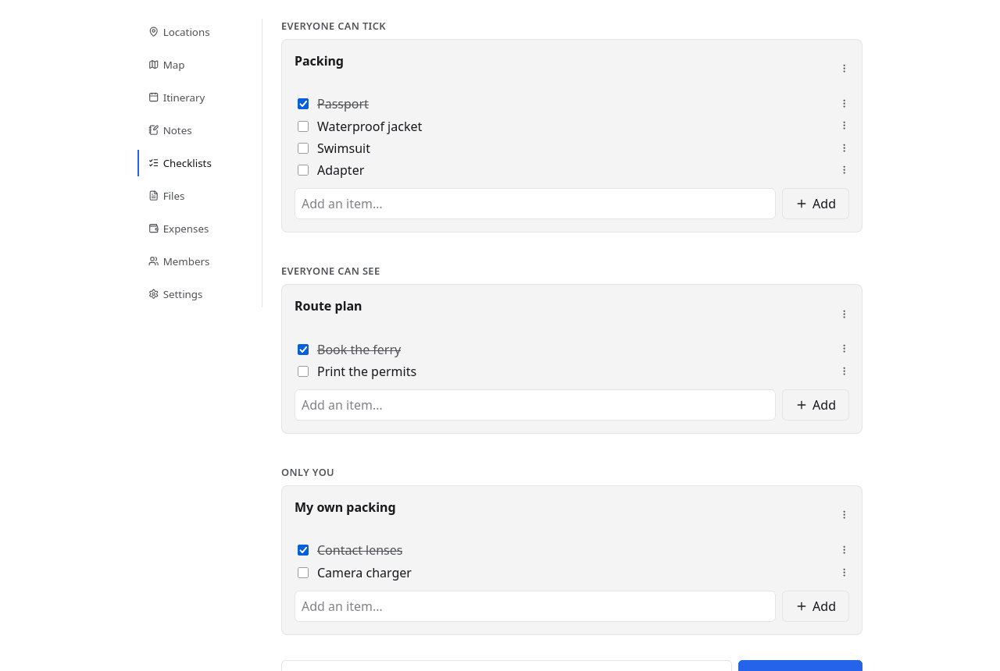

# The itinerary, files and lists

Locations answer *where*. The itinerary answers *when*, and the files and lists
hold everything you need to have with you.

## The itinerary

A day-by-day plan built from the locations already on the trip: pick a day, add
the things happening on it, reorder them. Days can carry a note of their own —
"Arrival day, take it easy" — and a day with nothing in it says so rather than
disappearing.

Days come from the trip's date range, and a day outside it can still be added
when the plan needs one. Nothing here duplicates a location: an itinerary entry
points at the same place that is on the map and in the locations list, so
correcting an address once corrects it everywhere.

That goes for dates too. A stay given the 5th to the 7th of September on its own
[location page](trips-and-locations.md) appears here on all three days, and
anything added or moved here shows up there as the days that location is on. The
two are one fact with two ways in — whichever you reach for, the other agrees.

{ .screenshot-phone }

On a phone the day cards stack and the tab row collapses to icons — which is the
form you actually read it in, standing outside somewhere at 9am.

## Files

Booking confirmations, tickets, permits, photos. Files attach either to the trip
or to a single location, and each one has a **visibility**:

| Visibility | Who sees it |
|---|---|
| Everyone on the trip | Every member, including viewers |
| Only you | Nobody else, on a trip you are sharing |

That second one is the point of the feature rather than a detail: your insurance
document and your passport scan belong on the trip, and not in front of everyone
else on it.

Which is why choosing a file does not upload it. Picks wait under the drop zone
until you press **Upload**, so the note and the visibility you set apply to the
files you just chose rather than to the next ones — and a file picked by mistake
can be taken back before it is sent anywhere.

Images are re-encoded on upload, which caps their dimensions and, as a side
effect, strips their metadata — so a photo's GPS tag does not travel with it into
a shared trip.

## Checklists

Packing lists, things to book, things to buy. Checklists have three
visibilities, and the difference between the first two is who can *tick*, not who
can see:

| Visibility | Who sees it | Who can tick |
|---|---|---|
| Everyone can tick | Every member | Any editor |
| Everyone can see | Every member | Whoever made it |
| Only you | Only you | Only you |

"Everyone can tick" is a shared packing list. "Everyone can see" is a plan the
group should read but not change. "Only you" is your own packing, on somebody
else's trip.

!!! note "Viewers read; they do not tick"

    Ticking anything needs the editor role, including on a list labelled
    "everyone can tick" — the label means every editor rather than every person
    who can see the trip. A viewer sees the shared lists and their state, and
    cannot change them.

A list can also be duplicated, which is how last year's packing list becomes
this year's.
