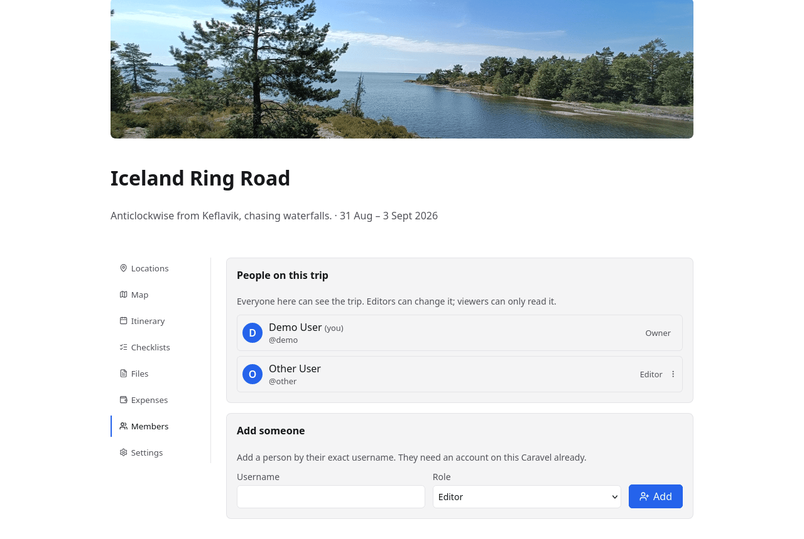
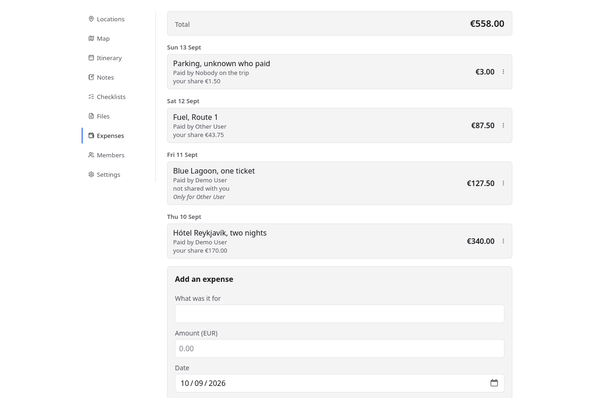
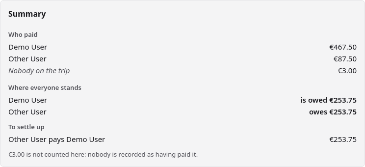

# Sharing and expenses

A trip with more than one person on it needs two things: everyone able to see the
plan, and a way to work out who owes whom at the end.

## Sharing a trip

Add someone by their **exact username** — they need an account on this Caravel
already, which is the point of a self-hosted app rather than a limitation.
There are two roles:

| Role | Can |
|---|---|
| **Editor** | Change anything on the trip, including ticking shared checklists |
| **Viewer** | Read everything shared with the trip, and change nothing |

The trip's owner cannot be removed, and removing somebody takes their access
immediately. If they had personal files or lists on the trip, Caravel says how
many will be deleted with them before you confirm — those are theirs, and nobody
else can see them.

## Expenses

Each trip has one **main currency**, chosen when you create it. Every amount is
stored as a whole number of the currency's smallest unit — cents for EUR, whole
yen for JPY — so nothing is ever a fraction of a cent out.

An expense records what it was for, what it cost, **who paid** and **who it was
for**. By default it splits evenly between everyone on the trip; untick "Split
with everyone" and it pins to a subset, and the row then says so ("Only for …"),
because otherwise a total would not follow from the amounts in front of you.

Every expense on a trip is visible to everyone on it, viewers included. There is
deliberately no private expense: a hidden row in a shared ledger makes an
incorrect total look correct.

## Settling up

From who paid and who each expense was for, Caravel works out where everyone
stands and suggests a short set of payments that settles it — not every pairwise
debt, just the transfers that clear it.

Two deliberate choices are visible in that screenshot. An expense **nobody is
recorded as having paid** is reported separately rather than split between people
who may not owe it. And nothing here marks a debt as paid: the settle-up list is
advice, not a record.

## More than one currency

A trip through Japan on a Euro budget wants both numbers on the row: the receipt
says ¥1,200 and the ledger says €7.60. So a trip can record expenses in
currencies other than its main one.

In **Settings → Other currencies**, add a currency and give it a rate — the form
reads as you would look it up, `1 JPY = 0.0058 EUR`. Once a currency is
configured, the expense form grows a picker beside the amount, and the field
follows what you choose: pick JPY and it stops offering decimals, because yen
have none.

An expense is **stored in what you actually paid** and **counted in the main
currency**. The row shows both — `¥12,000` with `≈ €69.60` under it — while the
total, everyone's share and the whole settle-up summary stay in one currency,
because a total in three currencies is not a total.

Three things are worth knowing:

- **Rates are live, not historical.** There is one rate per currency, and
  editing it re-converts every expense recorded in that currency. A trip's rate
  is "the rate we're using", not a record of the market on the day.
- **A currency in use cannot be removed.** Caravel says how many expenses hold
  it rather than leaving amounts it can no longer convert.
- **Rates are entered against the main currency at the time.** Changing the main
  currency later does not recalculate them, and does not convert amounts already
  recorded either — the settings form warns you when you try, and the rates are
  worth checking afterwards.

A trip that never adds a second currency sees none of this: no picker, no second
figure, exactly as before.
