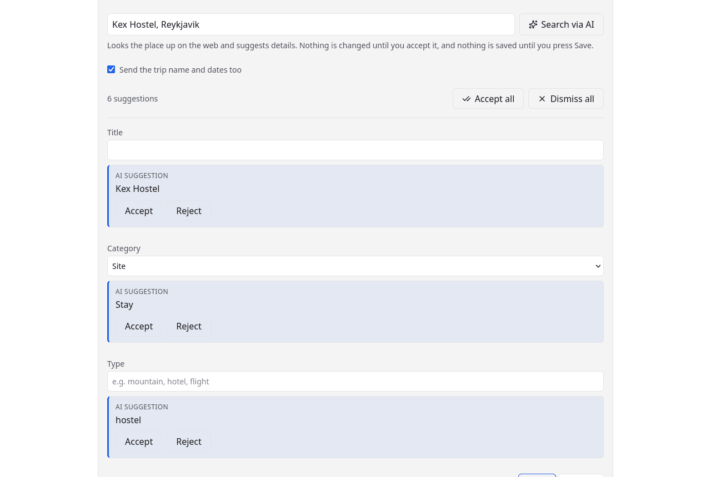

# The assistant

Filling in a location by hand means finding the address, the opening times, the
official page and the coordinates yourself. The assistant does that lookup and
proposes the answers — for one place you are already editing, or for several
places at once when you do not know what to add yet.

It is **off until you configure it** — it needs a model endpoint you host or pay
for. See [The assistant](../configuration/assistant.md) for the setup.

## Every suggestion is accepted per field

This is the whole design. The assistant does not fill the form in; it puts a
proposal next to each field, and each one is accepted or rejected on its own.
Anything that would replace text you already wrote is marked as such.

Nothing is written until you accept it, and nothing is saved until you press
**Save** — so the worst outcome of a bad run is pressing Cancel.

## Suggesting several places at once

The other way in. On a trip's **Locations** tab, the **New location** button is
a menu: *Blank location* fills in the form yourself, and *Suggest locations*
opens a page where you describe what you are after — "things to do in
Reykjavik", "somewhere to eat near the harbour" — and get back several
candidate places to look through.

Each candidate is a card with a tick box, ticked to start with, so reviewing
means untangling the ones you do not want rather than picking out the ones you
do. One button at the bottom adds the ticked ones **together, in a single
write**: either all of them land on the trip or none of them do.

Places the trip already has are left out, and the page says how many were
skipped — matched both by name and by position, so the same church under a
second spelling is still recognised as one you have.

Nothing is added until you press that button. Until then it is a list of
proposals, exactly as in the editor.

## What it can propose

The title, the category and tags, notes, an address, links, and coordinates.

Coordinates are the interesting case: **they never come from the model.** It
proposes an address, and the geocoder resolves that address into a position. A
plausible latitude and longitude 40km from the real hotel looks entirely correct
in the form and is wrong only on the map — the one error with no visible tell.

The pages the assistant used are listed with the suggestions so you can check
them. They are not saved.

## What it costs, and what bounds it

A run reads web pages, so it costs tokens at whatever your provider charges. A
suggestion run researches several places rather than one, so it costs
correspondingly more.
Every guard rail is an environment variable — token budget, turns, tool calls,
timeouts, runs per minute, runs at once — because these are the numbers an
operator wants to change the same day a bill surprises them. The defaults are
listed under [configuration](../configuration/assistant.md#limits).

Hitting a limit does not throw the run away: research stops and the assistant
answers with what it found.
