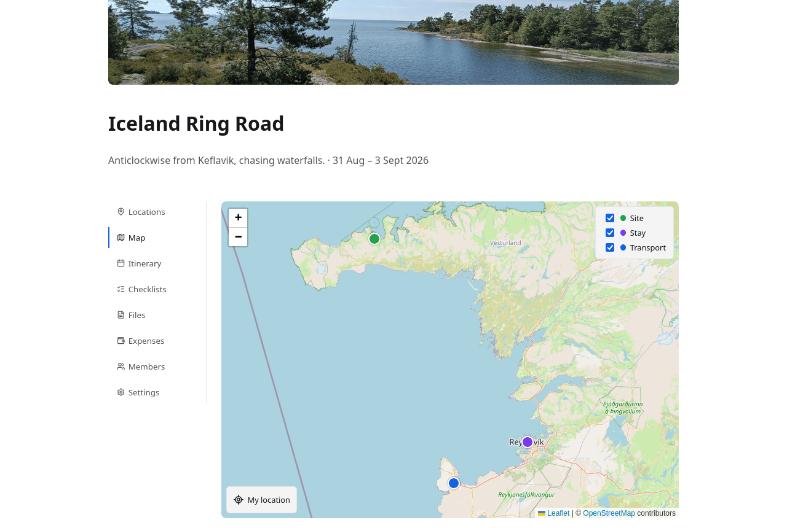
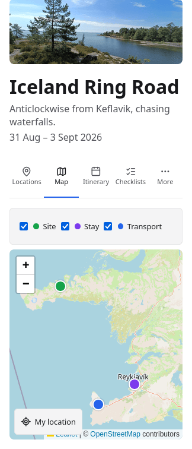

# The map

Every location with coordinates, on one map.

Pins are coloured by category — site, stay, transport — and each category can be
switched off, so "show me only where we are sleeping" is one click. The map
frames itself to fit whatever is currently shown.

Tiles come from OpenStreetMap. Clicking a pin opens the location, so the map
doubles as a way of navigating the trip rather than only a way of looking at it.

## Getting coordinates onto a location

Three ways, in the order most people use them:

1. **Search for the address.** The location editor looks it up and fills in the
   coordinates. This runs through Caravel's own server rather than from your
   browser — see [Address search](../configuration/address-search.md).
2. **Type them.** Paste a latitude and longitude from wherever you found them.
3. **Let the assistant propose an address**, then accept it. It never invents
   coordinates: it suggests an address and the geocoder resolves it. See [The
   assistant](the-assistant.md).

A location can also be deliberately kept off the map even when it has
coordinates, for something like a home airport you do not want framing the view.

## On a phone

{ .screenshot-phone }

The tab row collapses to icons with a **More** menu, and the category filter
moves above the map so it does not cover it. The map itself gets the rest of the
screen.
