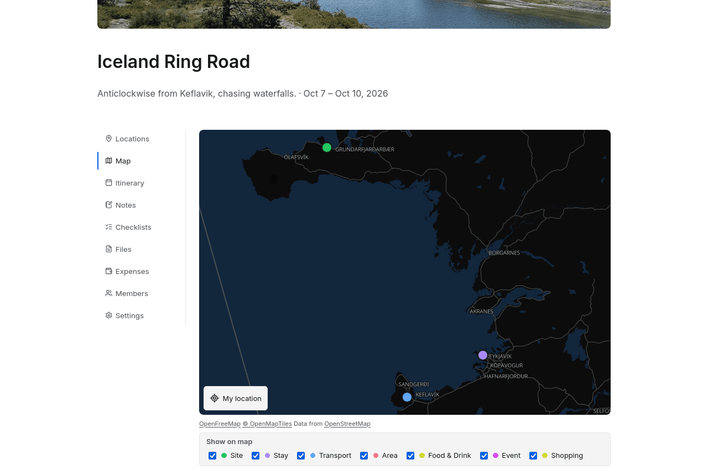
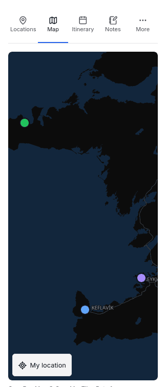

# The map

Every location with coordinates, on one map.

Pins are coloured by category — site, stay, transport, area, food & drink, event,
shopping. Under the map, **Show on map** switches any category off, so "show me
only where we are sleeping" is one click. The map frames itself to fit whatever
is currently shown.

The map is drawn in your browser from OpenStreetMap data, which means the
labels follow **your** language: the same trip reads Tokyo for an English
reader and Tokio for a German one, at the same time on the same instance. It
also comes in light and dark, independently of the rest of the app. By default
it follows the actual position of the sun over wherever the map is showing,
rather than your operating system's idea of evening — so a map of Iceland in
June stays light at 23:00, and one of Chile in the same session does not. Both
live in **Settings → Appearance**; the
provider itself is configurable too, see [Map
style](../configuration/map-style.md). Clicking a pin opens the location, so
the map doubles as a way of navigating the trip rather than only a way of
looking at it.

## Getting coordinates onto a location

Three ways, in the order most people use them:

1. **Search for the address.** The location editor looks it up and fills in the
   coordinates. This runs through Caravel's own server rather than from your
   browser — see [Address search](../configuration/address-search.md).
2. **Type them.** Paste a latitude and longitude from wherever you found them.
3. **Let the assistant propose an address**, then accept it. It never invents
   coordinates: it suggests an address and the geocoder resolves it. See [The
   assistant](the-assistant.md).

A location can also be deliberately kept off the map even when it has
coordinates, for something like a home airport you do not want framing the view.

## Where you are

**My location**, in the map's bottom-left corner, shows your own position and
keeps following it while the map is open. Press it again after panning away to
come back. It needs the page to be served over HTTPS; over plain HTTP the
browser will not hand out a position, and the button says so rather than
waiting forever.

What the marker shows:

- **The dot** is where you are. The faint ring around it is how sure the device
  is, so a large ring means a rough guess. A rough position is also spelled
  out under the map.
- **An arrow** replaces the dot once you are moving at walking pace or
  faster, pointing the way you are going. It comes from GPS, so it shows your
  path, not where the phone points, and it turns back into a dot when you stop.
- **A translucent cone** shows which way the phone is facing, from its
  compass, whether you are moving or not. On an iPhone it is wider when the
  compass is unsure of itself.

So "walking north, looking east" is an arrow pointing up with the cone off to
the right.

A phone without a compass, or one where you declined access to it, simply
shows no cone; the rest works the same. On an iPhone, the first press asks two
questions in a row, one for motion and orientation and one for your location.
The cone needs a yes to the first.

A phone compass is easily thrown off indoors, in a car, or near metal and
magnets (including some phone cases). If the cone points somewhere implausible,
moving the phone in a figure-eight a few times usually recalibrates it.

## On a phone

{ .screenshot-phone }

The tab row collapses to icons with a **More** menu, and the map gets the rest
of the screen. The category filter sits below the map, under the map credit, so
it never takes space from the map itself — scroll past the map to reach it.
