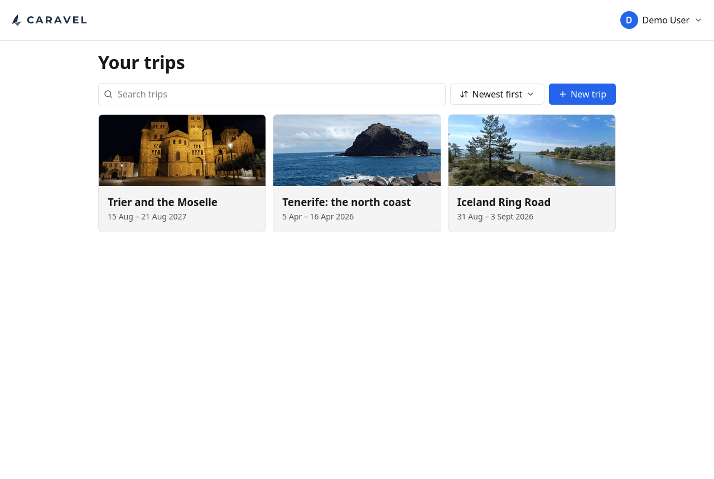
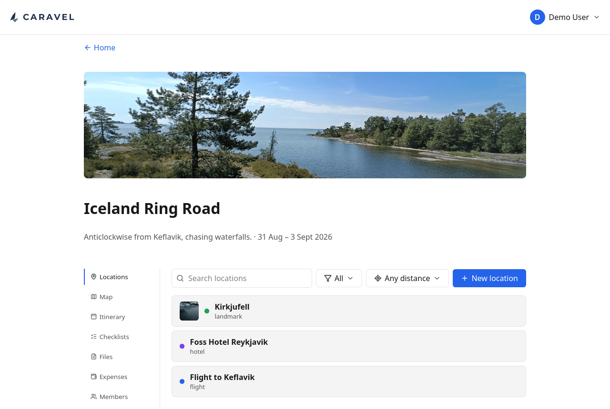
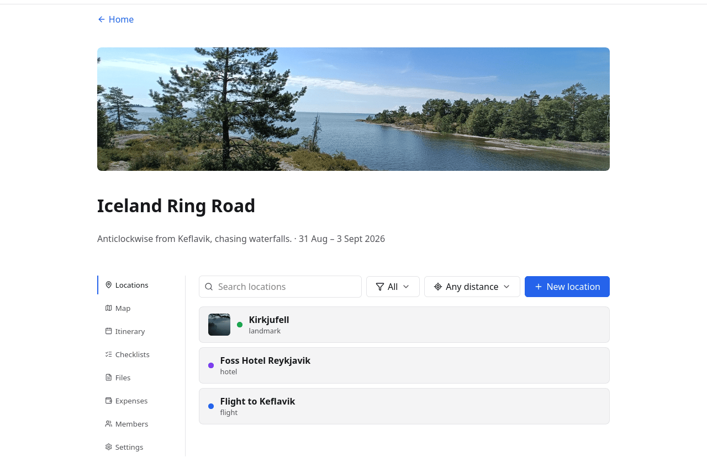
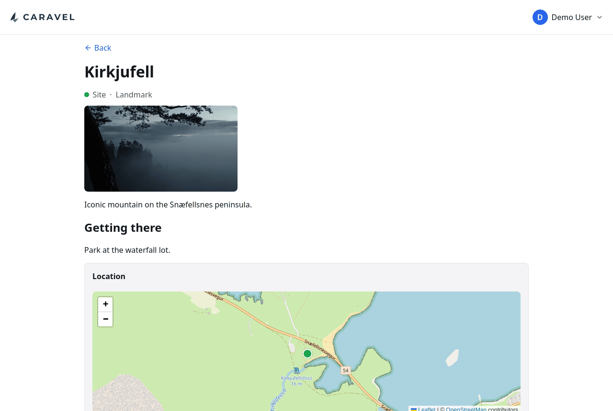
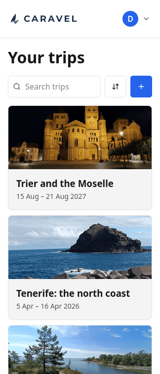

# Trips and locations

A trip is the container for everything else: the places, the plan, the files, the
people and the money. The trips list is what you land on.

Each card carries a cover photo, the title and the dates. Trips can be searched
and sorted, which starts mattering somewhere around the tenth one.

## Inside a trip

Everything about a trip lives behind one row of tabs. The cover photo, title,
subtitle and dates stay at the top wherever you are in it.

## Locations

A location is anywhere the trip touches, and it is one of three kinds:

| Category | For |
|---|---|
| **Site** | Somewhere you are going — a waterfall, a museum, a viewpoint |
| **Stay** | Somewhere you are sleeping |
| **Transport** | A flight, a ferry, a train, a car hire |

The list can be filtered by category, and by distance from a point — useful when
the question is "what else is near the hotel?" rather than "what is on the
trip?".

Beyond the category, a location carries a free-text **type** (`landmark`,
`hotel`, `flight`), which is what the map uses to pick an icon.

## A single location

Notes are Markdown, so a location can hold as much or as little as it needs: an
address and nothing else, or opening times, a route in from the road, and what to
do if the car park is full. Alongside the notes a location can carry coordinates,
links, its own dates, a photo, and files of its own.

Coordinates can be typed, searched for by address, or left out — a location with
no coordinates simply does not appear on the map, which is the right answer for
"a restaurant somebody recommended, somewhere in the city".

## On a phone

{ .screenshot-phone }

Caravel is installable as a PWA and is built for a phone as much as a desktop —
which is the device you actually have with you on the trip. Every screen works
down to 324px wide.
